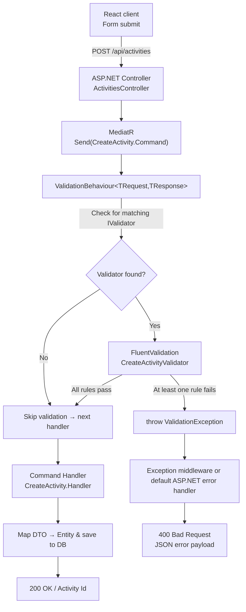

# Validation Pipeline – Reactivities API

This document gives a concise end-to-end overview of the validation infrastructure you have put in place. It is written for a React/JavaScript developer learning C# and .NET.

---

## 1 High-level Flow

1. **React client** submits a form → `POST /api/activities`.
2. **ActivitiesController** simply forwards the request via MediatR.
3. **ValidationBehaviour** (a MediatR pipeline behaviour) finds a matching FluentValidation validator and runs it.
4. **CreateActivityValidator** checks each rule declared with `RuleFor(...)`.
5. • If _all rules pass_ → execution continues to the command handler.<br>• If _any rule fails_ → a `ValidationException` is thrown.
6. **CreateActivity.Handler** persists the entity when validation succeeds.
7. **Exception middleware / default handler** converts the `ValidationException` into a `400 Bad Request` JSON payload for the React app.

---

## 2 Key Code Pieces

| Layer                              | File                                                           | Purpose                                     |
| ---------------------------------- | -------------------------------------------------------------- | ------------------------------------------- |
| Controller                         | `API/Controllers/ActivitiesController.cs`                      | Receives HTTP request; delegates to MediatR |
| Validation Behaviour               | `Application/Activities/Core/ValidationBehaviour.cs`           | Global pre-handler validation step          |
| FluentValidation Rules             | `Application/Activities/Validators/CreateActivityValidator.cs` | Declarative rule set (similar to Yup/Zod)   |
| Command Handler                    | `Application/Activities/Command/CreateActivity.cs`             | Business logic & DB save                    |
| (Optional) Custom Error Middleware | `API/Middleware/ValidationExceptionMiddleware.cs`              | Pretty JSON error formatting                |

---

## 3 Why This Design Rocks

- **Single-source rules** – no scattered `if` statements.
- **Automatic enforcement** – every request with a validator is checked; no forgotten calls.
- **Predictable errors** – frontend always receives the same `{ statusCode, message, errors }` shape.

---

## 4 Sequence Diagram (Mermaid)



---

### 5 At a Glance (React Analogy)

| .NET piece                      | React/JS analogy                                      |
| ------------------------------- | ----------------------------------------------------- |
| `RuleFor()`                     | Yup/Zod schema rule                                   |
| `ValidationBehaviour`           | Express / Apollo middleware that runs before resolver |
| `ValidationExceptionMiddleware` | Global error handler returning `{ errors }` JSON      |
| MediatR `Command`               | Redux action object                                   |
| Command `Handler`               | Redux thunk / service function                        |

> **Result:** All validation logic is declarative, DRY, and centrally enforced, while your controllers and handlers stay clean and focused on business logic.

## 6 Detailed Request Walk-through

1. **Controller receives request**  
    React sends `POST /api/activities` → `ActivitiesController.CreateActivity` receives a `CreateActivityDto`.
   Your React form sends POST /api/activities with a JSON body.
   ActivitiesController.CreateActivity receives it as a CreateActivityDto.
   The controller does no validation itself; instead it calls
   ```csharp
   [HttpPost]
   public async Task<ActionResult<string>> CreateActivity(CreateActivityDto dto)
   {
       return await Mediator.Send(new CreateActivity.Command { ActivityDto = dto });
   }
   ```
2. **Mediator dispatches**  
    Controller calls MediatR which constructs a pipeline.
   CreateActivity.Command is just a message object that wraps the DTO.
   MediatR looks at its pipeline behaviors before invoking the handler.
   ```csharp
   public class CreateActivity
   {
       public class Command : IRequest<string>
       {
           public required CreateActivityDto ActivityDto { get; set; }
       }
   }
   ```
3. **ValidationBehaviour executes**  
    Global behaviour checks for a validator.
   File: Application/Activities/Core/ValidationBehaviour.cs
   DI injects an IValidator<Command> if one exists.
   It runs

   ```csharp
     var result = await validator.ValidateAsync(request);
   if(!result.IsValid) throw new ValidationException(result.Errors);
   ```

   This is your central validation switch: every request that has a
   FluentValidation validator will be checked automatically.

   ```csharp
   public async Task<TResponse> Handle(TRequest request, RequestHandlerDelegate<TResponse> next, CancellationToken ct)
   {
       if (_validator == null) return await next();

       var result = await _validator.ValidateAsync(request, ct);
       if (!result.IsValid) throw new ValidationException(result.Errors);

       return await next();
   }
   ```

4. **FluentValidation rules evaluated**
   File: Application/Activities/Validators/CreateActivityValidator.cs
   Example rules

   ```csharp
   RuleFor(x => x.ActivityDto.Title)
       .NotEmpty().WithMessage("Title is required")
       .MaximumLength(100);

   RuleFor(x => x.ActivityDto.Date)
       .GreaterThan(DateTime.Now)
       .WithMessage("Date must be in the future");
   ```

   Think of this as your Yup/Zod schema in React.

5. **Command Handler runs** (only on success)
   All rules pass → control continues to the real command handler.
   Any rule fails → a ValidationException is thrown right here.

   ```csharp
   public async Task<string> Handle(Command request, CancellationToken ct)
   {
       var activity = _mapper.Map<Activity>(request.ActivityDto);
       _context.Activities.Add(activity);
       await _context.SaveChangesAsync(ct);
       return activity.Id;
   }
   ```

   6. **Error path** (when validation failed)

   ```csharp
   catch (ValidationException ex)
   {
       _logger.LogWarning(ex, "Validation error");
       await HandleValidationExceptionAsync(context, ex);
   }
   ```

   7. **Success path**
      File: Application/Activities/Command/CreateActivity.cs
      Maps DTO → Activity entity (AutoMapper).
      Saves to database (DbContext.SaveChangesAsync).
      Returns the new Activity Id.

---
